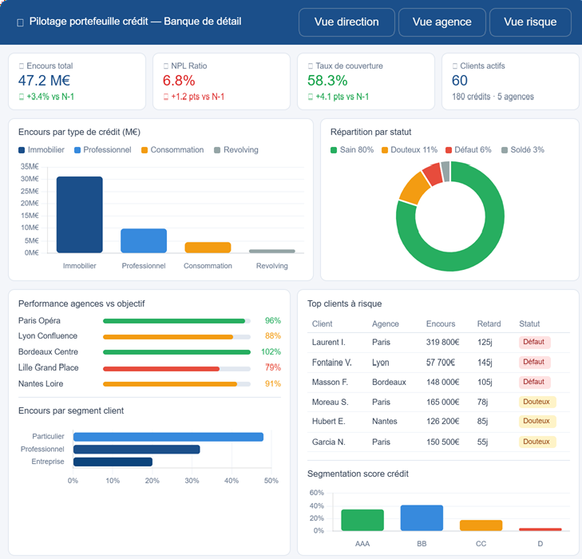

# 🏦 Analyse Risque Crédit & Pilotage de Portefeuille Bancaire 

> **Portfolio Project** | Business Data Analyst Freelance  
> Stack : SQL · Power BI · Excel  
> Secteur : Banque de détail

---

## 🎯 Contexte métier

Ce projet simule le travail d'un analyste data au sein d'une banque de détail régionale disposant de **5 agences**, **60 clients** et **180 crédits actifs**.

L'objectif est de répondre à 3 questions clés posées par la Direction :

1. **Quelle est la santé globale du portefeuille ?** (NPL ratio, taux de couverture)
2. **Quelles agences et quels conseillers performent ?** (réalisation vs objectif)
3. **Quels clients représentent un risque prioritaire ?** (scoring, jours de retard)

---

## 📁 Structure du projet

```
portfolio-bancaire/
│
├── sql/
│   ├── 01_schema.sql          # Création des tables
│   ├── 02_seed_data.sql       # Données de test réalistes
│   └── 03_analyses.sql        # 8 requêtes analytiques
│
├── dashboard/
│   └── POWER_BI_SPEC.md       # Spécification complète du rapport Power BI
│
└── README.md
```

---

## 🗃️ Modèle de données

```
agences ──────< clients >────── conseillers
                  │
                  └──────< credits
                               │
                               └──< mouvements_mensuels
```

| Table | Lignes | Description |
|-------|--------|-------------|
| agences | 5 | Agences bancaires régionales |
| conseillers | 15 | 3 conseillers par agence |
| clients | 60 | Particuliers, Professionnels, Entreprises |
| credits | 180 | 3 crédits par client (Immobilier, Conso, Revolving, Pro) |

---

## 📊 Analyses SQL réalisées

| # | Requête | Indicateur clé |
|---|---------|---------------|
| 1 | KPIs Globaux | NPL Ratio, Taux de couverture |
| 2 | Répartition par statut | Encours Sain / Douteux / Défaut / Soldé |
| 3 | Taux de défaut par segment | Particulier vs Pro vs Entreprise |
| 4 | Performance agences vs objectif | Taux de réalisation |
| 5 | Top 10 clients à risque | Encours à risque, jours retard |
| 6 | Répartition par type de crédit | NPL par produit |
| 7 | Segmentation par score | Classes AAA / BB / CC / D |
| 8 | Performance conseillers | NPL et encours par conseiller |

---

## 📈 Dashboard Power BI (3 pages)

### Page 1 — Vue Direction
- Encours total, NPL Ratio, Taux de couverture
- Répartition encours par statut et type de crédit
- Évolution mensuelle du portefeuille

### Page 2 — Vue Agence
- Réalisation vs objectif par agence
- Performance des conseillers
- Encours par segment client

### Page 3 — Vue Risque
- Scatter plot score crédit vs encours
- Top 10 clients à risque
- Heatmap NPL par agence × type de crédit

---

## 🔑 Concepts métier bancaires couverts

| Terme | Définition |
|-------|-----------|
| **NPL Ratio** | Non-Performing Loans — part des crédits douteux et en défaut sur l'encours total |
| **Encours** | Capital restant dû sur un crédit |
| **Provisions** | Montant mis en réserve pour couvrir le risque de perte sur un crédit NPL |
| **Taux de couverture** | Provisions / Encours NPL — mesure la prudence du provisionnement |
| **Score crédit** | Notation interne du risque client (0-1000) |
| **Douteux** | Crédit avec 30-89 jours de retard de paiement |
| **Défaut** | Crédit avec 90+ jours de retard — classification réglementaire (Bâle III) |

---

## 🚀 Lancer le projet

### Prérequis
- SQLite (ou DuckDB, PostgreSQL)
- Power BI Desktop

### Étapes

```bash
# 1. Créer la base de données
sqlite3 portefeuille_credit.db < sql/01_schema.sql

# 2. Injecter les données
sqlite3 portefeuille_credit.db < sql/02_seed_data.sql

# 3. Lancer les analyses
sqlite3 portefeuille_credit.db < sql/03_analyses.sql
```

```
# 4. Power BI
- Ouvrir Power BI Desktop
- Connecter à la base SQLite
- Suivre POWER_BI_SPEC.md pour construire le rapport
```

---

## 👤 Auteur

**[Bleze TCHALLA]**  
Business Data Analyst Freelance  
Spécialité : Pilotage de performance · KPIs · Power BI · SQL

[](https://linkedin.com/in/bleze-tchalla)

---

*Ce projet utilise des données entièrement fictives générées pour illustrer des cas d'usage réels en banque de détail.*
